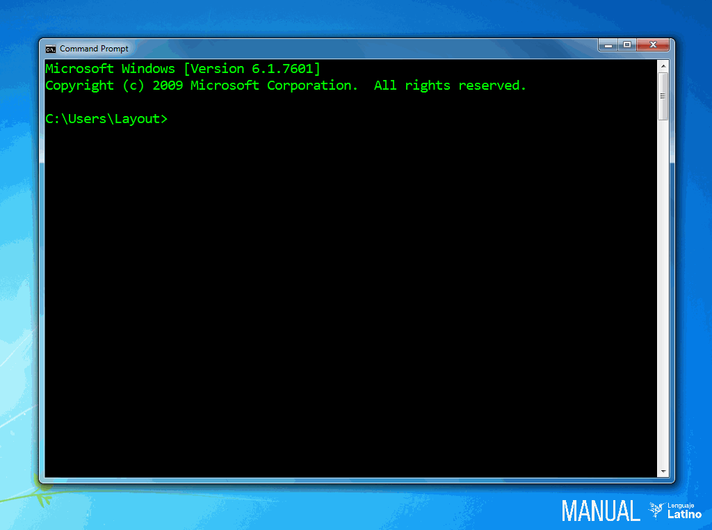

.. _consolaLink:

.. meta::
   :description: Comandos de consola en Latino
   :keywords: manual, documentacion, latino, consola, comando

=====================
Comandos de Consola
=====================
Los comandos de consola son algunas funciones que podemos efectuar con Latino antes de ejecutarlo en nuestra consola o terminal.

A continuación se presentará una tabla con los comandos de consola disponibles en Latino.

+--------------+--------------------------------------------+
| Comando      | Descripción                                |
+==============+============================================+
| -a           | Muestra la ayuda de Latino en la terminal  |
+--------------+                                            |
| \- \-ayuda   |                                            |
+--------------+                                            |
| \- \-help    |                                            |
+--------------+--------------------------------------------+
| -e           | Ejecuta un comando con código de Latino    |
+--------------+--------------------------------------------+
| -v           | Muestra la versión instalada de Latino     |
+--------------+                                            |
| \- \-version |                                            |
+--------------+--------------------------------------------+
| Ctrl + C     | Cierra el programa de Latino en la consola |
+--------------+--------------------------------------------+

----

Comandos
---------

Mostrar menú de ayuda
++++++++++++++++++++++
El menú de ayuda de Latino lo podemos ejecutar con el siguiente comando:

.. code-block:: bash
   
   latino -a
   latino --ayuda
   latino --help

Ejecutar un comando
+++++++++++++++++++++
Para ejecutar un comando con código de Latino en la consola usamos el siguiente comando:

.. code-block:: bash
   
   latino -e *código de Latino*

Ver versión de Latino
++++++++++++++++++++++
Para mostrar la versión de Latino que se tiene instalada en nuestro sistema, podemos usar el siguiente comando:

.. code-block:: bash
   
   latino -v
   latino --version

.. _atajoConsolaLink:

Cerrar programa de Latino
++++++++++++++++++++++++++
Si después de iniciar o correr Latino en nuestra consola deseamos salir o cerrar el programa, podemos presionar la siguiente combinación de teclado:

.. code-block:: bash
   
   Ctrl + C

Podemos también salir de Latino escribiendo el comando explicado :ref:`aquí <sisSalirLink>`.

