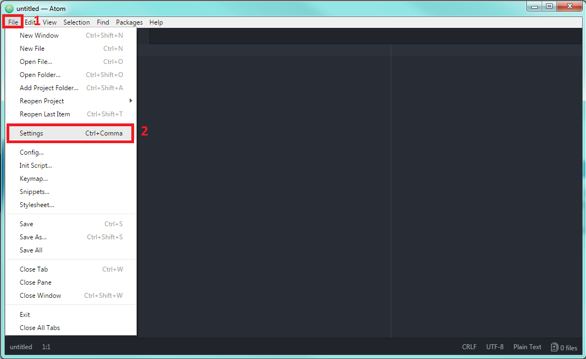
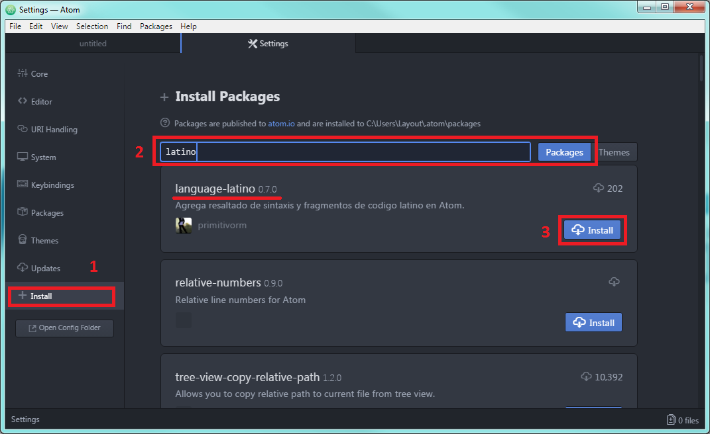

.. meta::
   :description: Latino en el editor Atom
   :keywords: instalacion, latino, editor, atom

=====
Atom
=====
**Sintaxis de Latino en Atom**

Para poder usar la sintaxis de Latino en Atom, estos son los pasos a seguir una vez tengamos el programa abierto:

* Clic en Archivo (File) > Configuraciones (Settings)
* Clic en Install > En el buscador escribimos **Latino** y presionamos Enter y por último **Install**
* **y Listo!** Ya podremos programar en Atom con sintaxis de Latino

