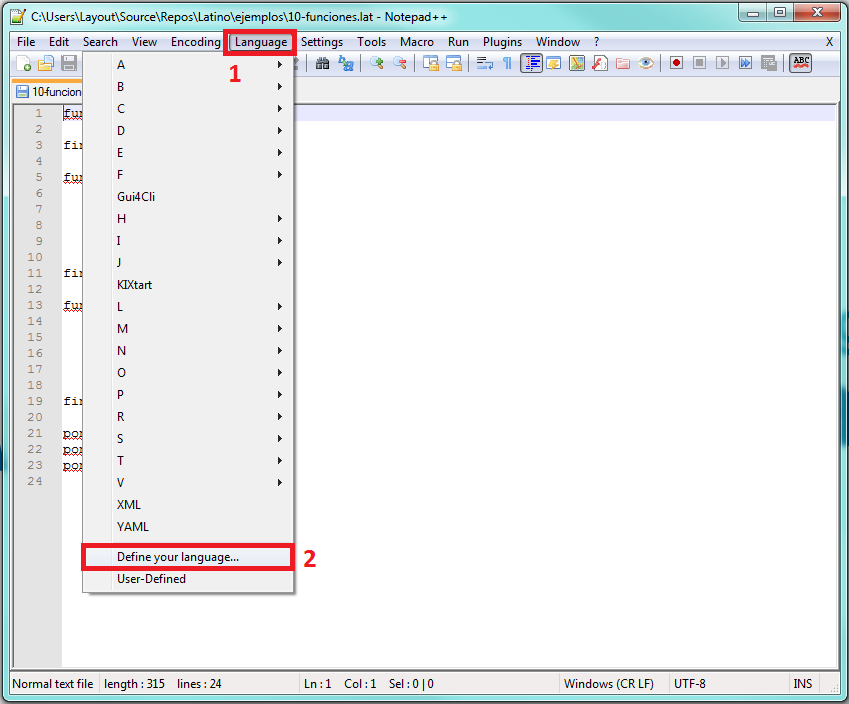
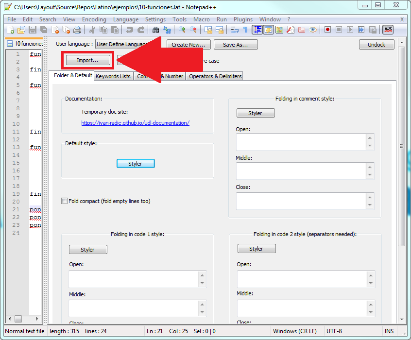
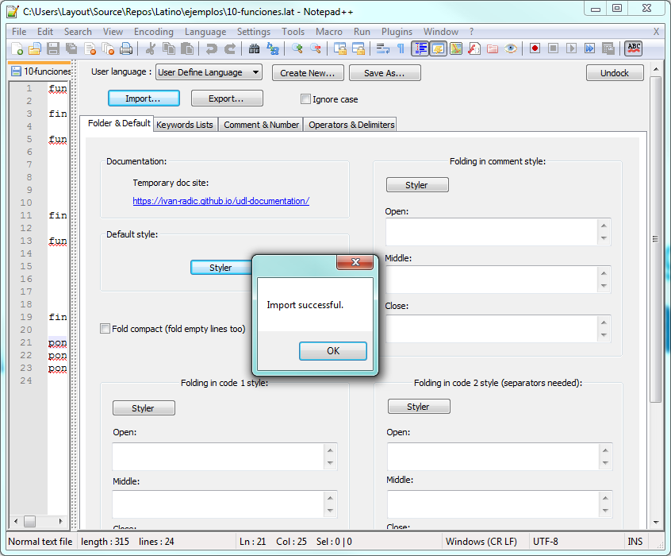
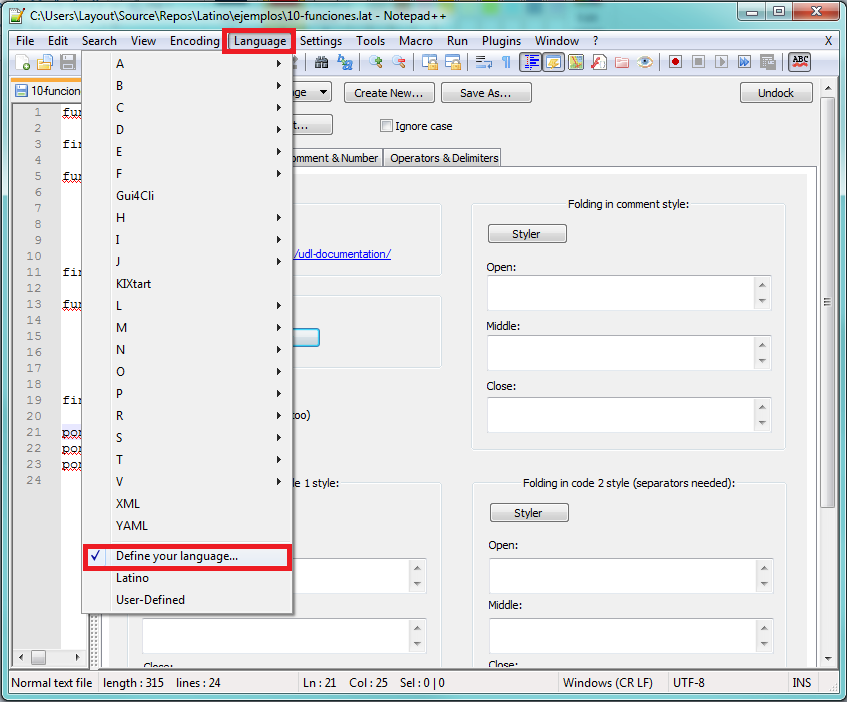
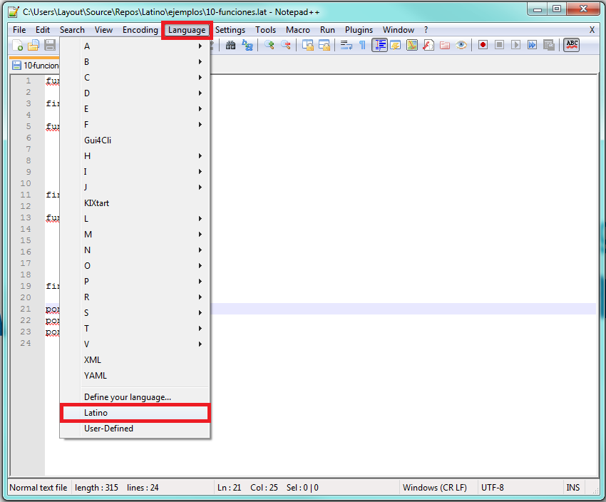

.. meta::
   :description: Latino en el editor Notepad++
   :keywords: instalacion, latino, editor, nodepad

==========
Notepad++
==========

.. admonition:: Descargar

   :download:`Descargar Latino-Notepad++ <https://github.com/lenguaje-latino/latino-notepad-plugin>`

**Sintaxis de Latino en Notepad++**

Para poder usar la sintaxis de Latino en Notepad++, estos son los pasos a seguir una vez tengamos el programa abierto:

* Clic en el menú Lenguaje > Definir Idioma
* Clic en el botón **Importar**
* Seleccionamos el archivo **Latino.xml**
* **Reinicie** Notepad++ para que tome la configuración. (Una vez que vuelva a abrir el programa, si la ventana de Definir Idiomas continúa visible lo podemos quitar dando clic en Lenguaje > Definir Idioma)
* Para activar el Plugin de Latino, sólo tendremos que hacer clic en Lenguaje > Latino
* **y Listo!** Ya podremos programar en Notepad++ con sintaxis de Latino

.. figure:: ../_static/_media/editores-Instalacion/Notepad/Seleccionar.png
   :figwidth: 100%
   :target: ../_static/_media/editores-Instalacion/Notepad/Seleccionar.png

.. container:: nota

  |  **Importante**
  |  LLegado a este punto, **reinicie Notepad++**

