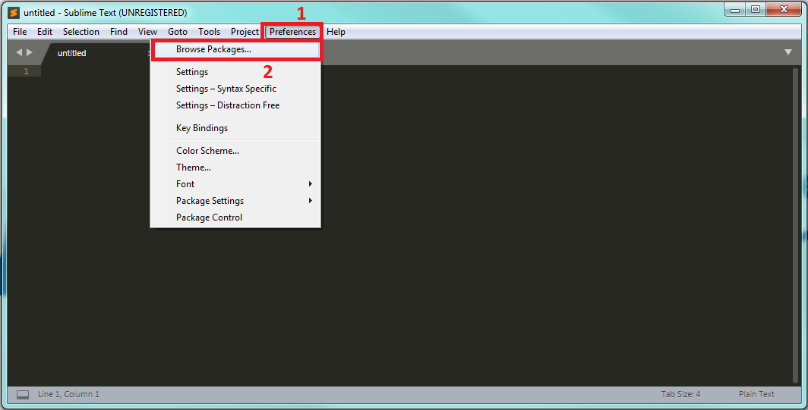
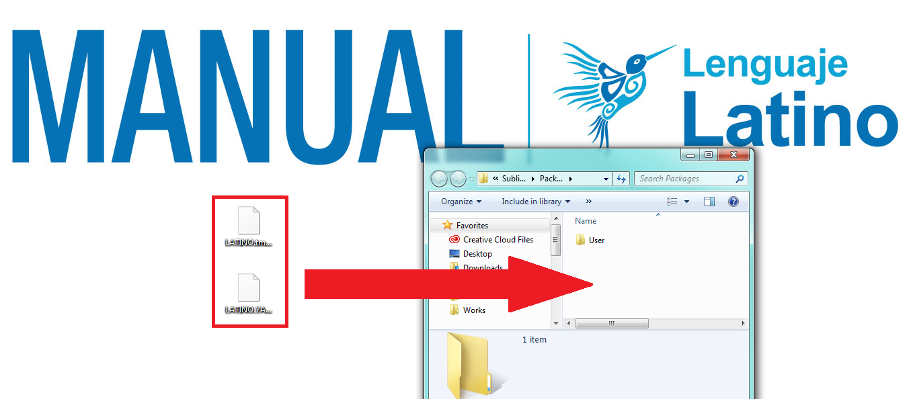
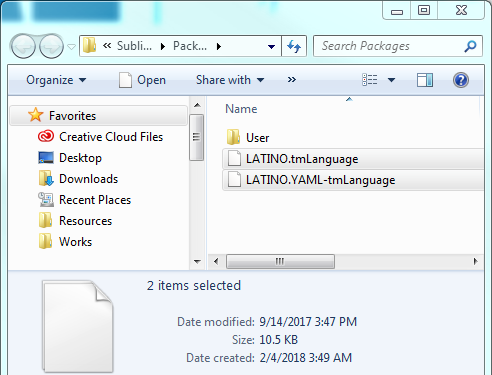

.. meta::
   :description: Latino en el editor Sublime Text
   :keywords: instalacion, latino, editor, sublime

=============
Sublime Text
=============

.. admonition:: Descargar

   :download:`Descargar Latino-SublimeText <https://github.com/lenguaje-latino/latino-sublimetext-plugin>`

**Sintaxis de Latino en Sublime Text**

Para poder usar la sintaxis de Latino en Sublime Text, estos son los pasos a seguir una vez tengamos el programa abierto:

* Clic en el menú Preferences > Browse Packages...
* Una vez nos abra el folder, pasaremos a arrastrar y solar (o copiar) los siguientes archivos **LATINO.tmLanguage** y **LATINO.YAML-tmLanguage**
* Reinicie Sublime Text para que tome la configuración.
* **y Listo!** Ya podremos programar en Sublime Text con sintaxis de Latino

