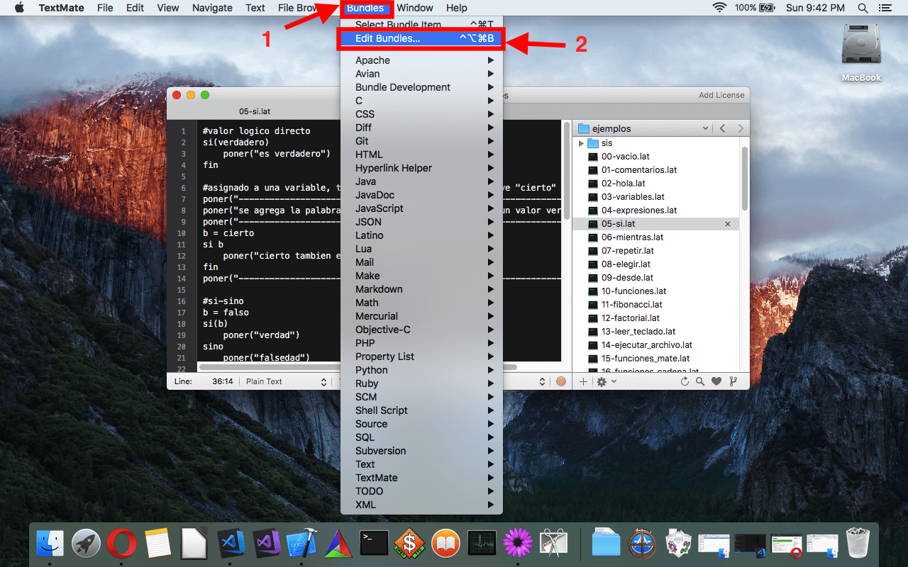
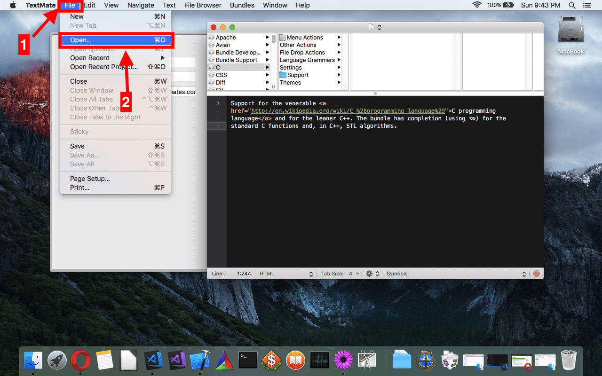
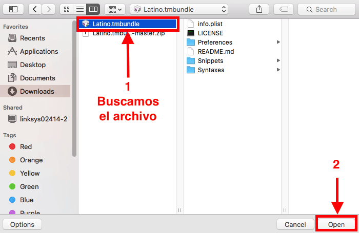
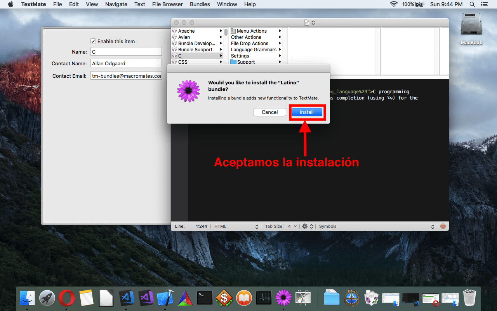
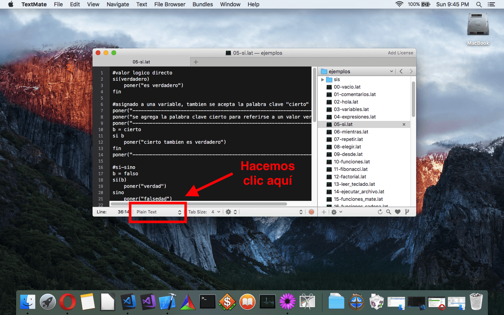
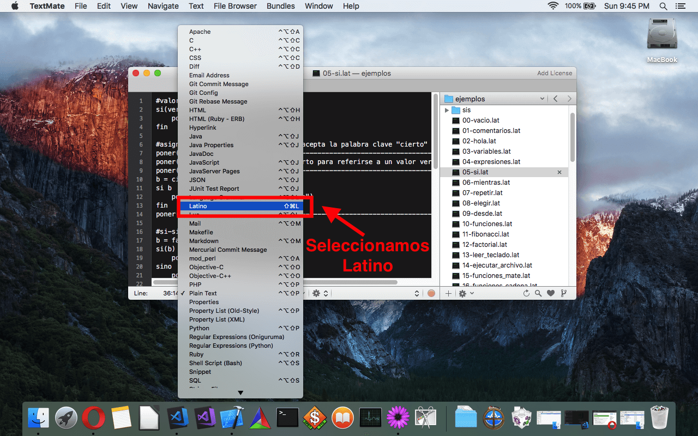
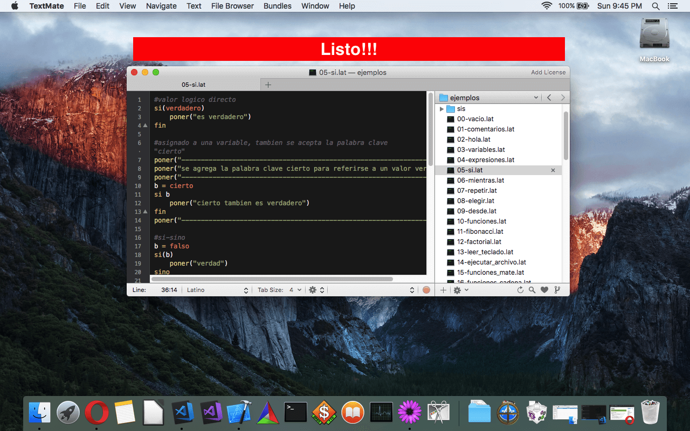

.. meta::
   :description: Latino en el editor TextMate
   :keywords: instalacion, latino, editor, textmate

=========
TextMate
=========

.. admonition:: Descargar

   :download:`Descargar Latino-TextMate <https://github.com/MelvinG24/Latino-TextMate/releases/latest>`

**Sintaxis de Latino en Sublime Text**

Para poder usar la sintaxis de Latino en TextMate, estos son los pasos a seguir una vez tengamos el programa abierto:

* Descargado el archivo de **latino.tmbundle**
* En TextMate hacemos clic en el menú **Bundles > Edit Bundles...**
* Una vez nos abra la ventana, pasaremos a hacer clic en el menu **File > Open...**
* Pasamos a buscar el archivo **latino.tmbundle**
* Cambiamos el tipo de lenguaje en TextMate 
* **y Listo!** Ya podremos programar en TextMate con sintaxis de Latino

