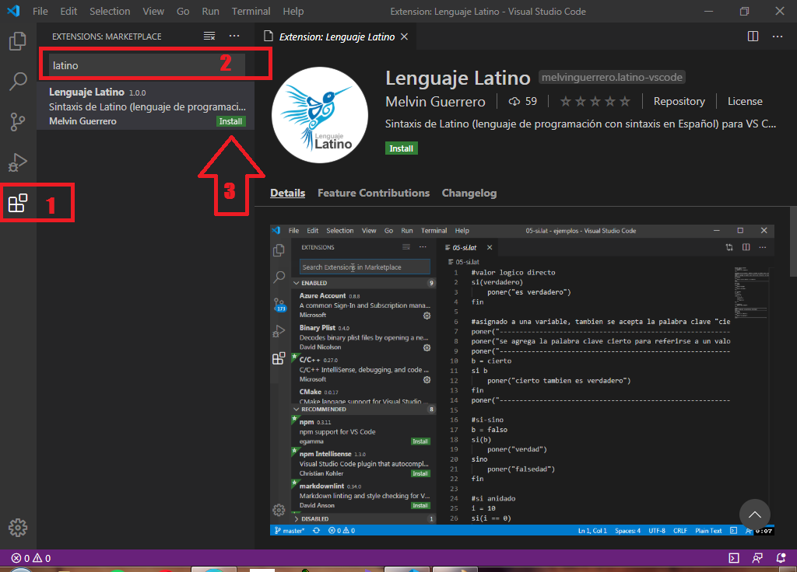

.. _vscodeLink:

.. meta::
   :description: Latino en el editor VS-Code
   :keywords: instalacion, latino, editor, vscode

========
VS Code
========
**Sintaxis de Latino en VS Code**

Para poder usar la sintaxis de Latino en VS Code, estos son los pasos a seguir una vez tengamos el programa abierto:

* Clic en Extensiones o precionando su atajo de teclado **Ctrl+Shift+X**
* En el buscador escribimos **Latino** y presionamos Enter y por último **Install**
* **y Listo!** Ya podremos programar en VS Code con sintaxis de Latino

