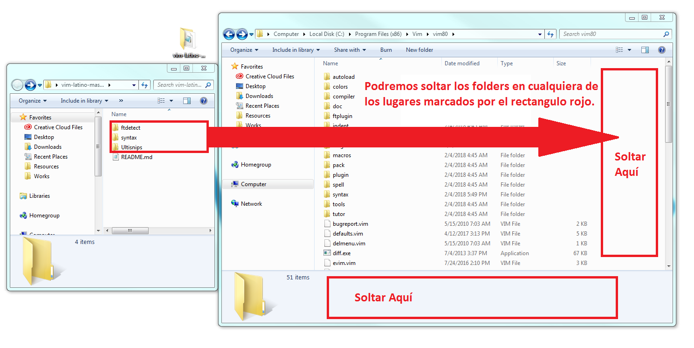
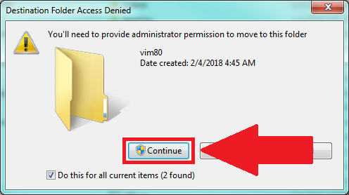
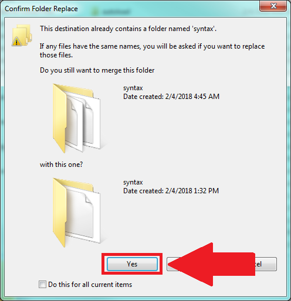

.. _vimLink:

.. meta::
   :description: Latino en el editor Vim
   :keywords: instalacion, latino, editor, vim

=====
Vim
=====

.. admonition:: Descargar

   :download:`Descargar Latino-Vim <https://github.com/primitivorm/vim-latino>`

**Sintaxis de Latino en Vim**

Para poder usar la sintaxis de Latino en Vim, estos son los pasos a seguir:

* Con el **programa cerrado**, nos vamos a donde tenemos el programa instalado **C:\\Program Files (x86)\\Vim\\vim80**
* Una vez ahí pasamos a copiar y pegar las carpetas **ftdetect**, **syntax** y **Ultisnips** en la dirección anterior **vim80**
* Aceptamos y confirmamos cuando se nos pregunte si queremos mezclar (**merge**) los archivos.
* **¡Y listo!** Ya podremos programar en Vim con la sintaxis de Latino

